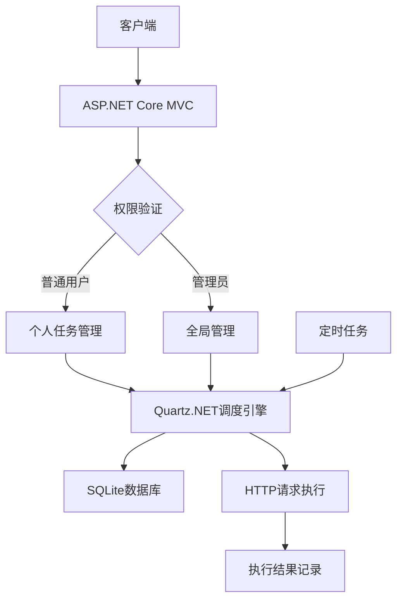

# HTTP任务计划调度系统

## 项目介绍
- **.NET 9.0 + Quartz.NET**：高性能框架组合，支持复杂任务调度，带cron表达式设计器
- **简单权限分层**：普通用户仅能管理个人任务，管理员可全局操作
- **SQLite存储**：轻量级数据库，无需额外部署
- **完整生命周期管理**：任务创建、编辑、执行、日志查看一体化

## 核心功能
| 模块       | 普通用户权限               | 管理员权限                   |
|------------|---------------------------|-----------------------------|
| 任务管理   | 创建/编辑/删除个人任务     | 管理所有用户任务             |
| 执行控制   | 启动/暂停/立即执行         | 同上 + 清空执行日志          |
| 数据查看   | 查看个人任务执行计划       | 查看所有任务及用户信息       |
| 用户管理   | 无                         | 创建/编辑用户，分配角色      |

## 技术架构


## 快速部署
```bash
# 1. 克隆项目
git clone https://gitee.com/xtjatswc/http-task-scheduler.git

# 2. 配置数据库
dotnet ef database update

# 3. 启动服务
dotnet run
```

## API密钥认证
任务调度走轻量化配置，推荐用简单的认证方式，如果需要复制的认证机制，可基于本项目做二次开发

```csharp
// 发送方
在任务创建页面配置Headers：
X-API-Key:your-secret-api-key

// 接收方
[ApiController]
public class MyController : ControllerBase
{
    [HttpGet("secure-data")]
    public IActionResult GetSecureData()
    {
        if (!Request.Headers.TryGetValue("X-API-Key", out var apiKey) || 
            apiKey != "your-secret-api-key")
        {
            return Unauthorized();
        }
        
        return Ok("Secure data");
    }
}
```

## 默认账户
| 角色   | 用户名   | 密码       |
|--------|----------|------------|
| 管理员 | admin    | tDPjRYhkFpMidxFk   |
| 普通用户 | user     | 5CCeyuLFQqGfO41E    |

## Docker构建
```bash
# 构建
docker build -t httptaskscheduler:latest .

# 运行
docker run --name httptask -dit -p 8080:8080 httptaskscheduler:latest

# 数据持久化，将app.db数据文件挂载出来
docker run --name httptask -dit -p 8080:8080 -v /yourpath/app.db:/app/app.db httptaskscheduler:latest
```